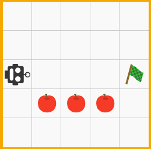

# Assignment robot-0

Your assignment is to modify this code to implement the [Rover Game](http://roverjs.com/), Level 1 of the Functions chapter. Please play this level [online](http://roverjs.com/) and copy and paste the code that was necessary to play this level over the old `move()` and `turn()` functions at the end of `robot.js`.

The initial board setup for this Level is given in the picture below.



There are no tree or water obstacles in this level. There are a couple of apples that the robot wants to eat. To eat an apple the robot simply needs to move over it. Reaching the flag remains the end goal.

 - To implement this level in the JavaScript code you must change the `board` array to reflect the new game setup. Use an `'A'` to represent an apple.

 - You must change the initialization of the `robot` object to reflect the new initial position and direction of the robot.

 - Add two new variables (below the line `let flagReached = false;`) as follows:

    ```js
    let flagReached = false;
    let appleEaten = false;
    let applesEaten = 0;
    ```

  - Change the `move()` function such that the variable `appleEaten` is re-initialized to `false`:

    ```js
    function move() {
      let x = robot.x;
      let y = robot.y;
      appleEaten = false;
      ...
    }
    ```

- Make further modifications to the `move()` function such that `appleEaten` is set to true and `applesEaten` is incremented by one if passing over an apple. Remember that an apple is not an obstacle. The robot should be able to simply move over it.

- In the `render()` function, after rendering the board, check if an apple was eaten during the last move and print `'YUM!'` on the console if true.

- In the `render()` function, if the flag was reached, add a console.log to indicate how many apples were eaten.

Have fun!