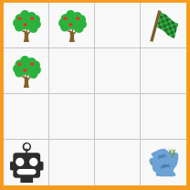
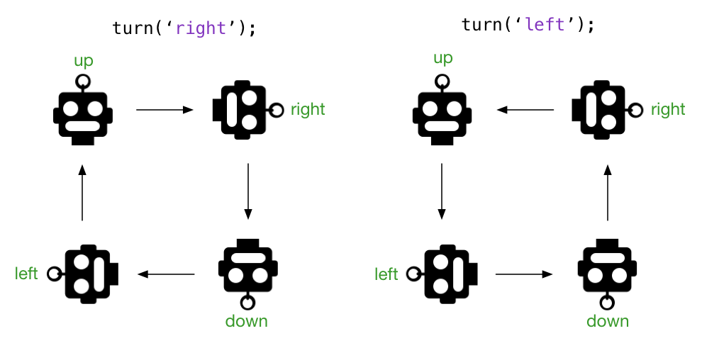
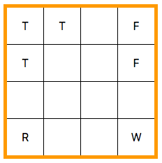

# RobotApp

## Introduction

This project was inspired by the [RoverJS](http://roverjs.com/) app developed by HYF teacher @joostlubach:

> https://roverjs.com/ (alternative: http://roverjs.taalmap.nl/) 
> 
>_Hello! I'm Rover, I'm a robot. You can program me through JavaScript._
>
>
>
> _I understand two commands, which are JavaScript functions:_
>
> - `move()`
> - `turn(direction)`
> 
> _The second function takes one argument, which should be the direction to turn to ('left' or 'right')._
>
> _I cannot walk through obstacles (trees, water). Can you get me to the flag?_
>

The objective of the project in this repository is to write a JavaScript application that rebuilds the RoverJS game board and adds ways to direct the robot towards the flag, using buttons or commands rather than through user-provided JavaScript functions. This is done step-wise through eight different, progressively more advanced versions of the application.

## Robot State

In the robot code the state of the game is kept in a number of variables.
The state consist of:

| Variable      | Description                                                     |
| ------------- | --------------------------------------------------------------- |
| `board`       | A two-dimensional array representing the board.                 |
| `robot`       | The `x` and `y` coordinates and `dir` (direction) of the robot. |
| `moves`       | The number of moves made so far.                                |
| `turns`       | The number of turns made so far.                                |
| `flagReached` | A boolean indicating whether the flag has been reached.         |


This state is updated as the robot moves and turns. After each state change the game board is rerendered.

```js
const board = [
  ['T', 'T', '.', 'F'],
  ['T', '.', '.', '.'],
  ['.', '.', '.', '.'],
  ['R', '.', '.', 'W']
];

const robot = {
  x: 0,
  y: 0,
  dir: 'up'
};

let moves = 0;
let turns = 0;
let flagReached = false;
```

>Note that the rows in the board array are defined in the order as they appear visually on the page, where the origin (0, 0) is in the lower left-hand corner. To make the origin (0, 0) correspond to the array indices [0, 0] we need to reverse the rows at the start of the application.

## Turning the robot

The robot can turn `left` and `right`. The new direction of the robot (indicated by the 'antenna' on its head) depends on its current direction (`up`, `down`, `left`, `right`) and the turn direction. This is illustrated in the picture below.



The following code snippet uses a `switch` statement and [conditional (ternary) operators](https://developer.mozilla.org/en-US/docs/Web/JavaScript/Reference/Operators/Conditional_Operator) to establish the necessary state change of the robot's direction (or should we say _'heading'_ :grinning:).

```js
function turn(turnDirection) {
  if (turnDirection !== 'left' && turnDirection !== 'right') {
    console.log('ignoring invalid turn', turnDirection);
  }

  switch (robot.dir) {
    case 'up':
      robot.dir = turnDirection === 'left' ? 'left' : 'right';
      break;
    case 'down':
      robot.dir = turnDirection === 'left' ? 'right' : 'left';
      break;
    case 'left':
      robot.dir = turnDirection === 'left' ? 'down' : 'up';
      break;
    case 'right':
      robot.dir = turnDirection === 'left' ? 'up' : 'down';
      break;
  }

  turns += 1;
}
```

The conditional operator is a convenient short-hand for the alternative of using `if` statements. Its syntax is:

> _condition_ ? _expr1_ : _expr2_

If the condition is `true` the resulting value is `expr1`, otherwise it's `expr2`.

For more details, please refer to [MDN web docs, Conditional (ternary) Operator](https://developer.mozilla.org/en-US/docs/Web/JavaScript/Reference/Operators/Conditional_Operator).

In the code snippet above we are testing whether `turnDirection === 'left'` in the knowledge that if it isn't `left` it must be `right`. Alternatively we could have tested for `turnDirection === 'right'` and swapped the two expressions in each of the conditional operators.

## Moving the robot

Moving the robot means adding or subtracting `1` from either its `y` (vertical) position or its `x` (horizontal) position, depending on the current direction of the robot. As a complicating factor, we also must ensure that the robot doesn't 'fall off the board'. In the code snippet below we again use conditional operators to ensure the `x` and `y` values stay within the range of the `board` array.

```js
function move() {
  let x = robot.x;
  let y = robot.y;

  switch (robot.dir) {
    case 'up':
      y = Math.min(board.length - 1, y + 1);
      break;
    case 'down':
      y = Math.max(0, y - 1);
      break;
    case 'left':
      x = Math.max(0, x - 1);
      break;
    case 'right':
      x = Math.min(board[y].length - 1, x + 1);
      break;
  }
  // ...
}
```

The newly computed `x` and `y` values represent the desired new position of the robot, but we can only move there if there is no obstacle (e.g., tree, water) in that position. If there is an obstacle in the newly computed position the robot must stay where it is. Otherwise we can update the robot state to reflect the new position.

The flag is not considered an obstacle but when it is reached we set the `flagReached` state to `true`. And finally, we re-render the board on the screen. The code snippet below shows the complete implementation of the `move()` function.

```js
function move() {
  let x = robot.x;
  let y = robot.y;

  switch (robot.dir) {
    case 'up':
      y = Math.min(board.length - 1, y + 1);
      break;
    case 'down':
      y = Math.max(0, y - 1);
      break;
    case 'left':
      x = Math.max(0, x - 1);
      break;
    case 'right':
      x = Math.min(board[y].length - 1, x + 1);
      break;
  }

  const cell = board[y][x];

  if (cell === '.' || cell === 'F') {
    board[robot.y][robot.x] = trailIndicators[robot.dir];
    robot.x = x;
    robot.y = y;
    if (cell === 'F') {
      flagReached = true;
    }
  }

  moves += 1;
  renderBoard();
}
```

## Creating HTML elements through the DOM

In a Single Page Application it is customary to work with a very simple `index.html` file that contains just a single `<div>` inside the `<body>` where HTML elements, dynamically generated by means of JavaScript, are 'mounted'.

```html
<!DOCTYPE html>
<html lang="en">

<head>
  <meta charset="UTF-8">
  <meta name="viewport" content="width=device-width, initial-scale=1.0">
  <meta http-equiv="X-UA-Compatible" content="ie=edge">
  <link rel="stylesheet" href="style.css">
  <title>Robot</title>
</head>

<body>
  <div id="root"></div>
  <script src="robot.js"></script>
</body>

</html>
```

For the robot game we will render the game board as a grid, using an HTML `<table>` tag. This will become a child of the `<div id=root>`. The snippet below can serve as a model of what HTML we should create in our JavaScript code.

```html
<table>
  <tr>
    <td>T</td>
    <td>T</td>
    <td></td>
    <td>F</td>
  </tr>
  <tr>
    <td>T</td>
    <td></td>
    <td></td>
    <td>F</td>
  </tr>
  <tr>
    <td></td>
    <td></td>
    <td></td>
    <td></td>
  </tr>
  <tr>
    <td>R</td>
    <td></td>
    <td></td>
    <td>W</td>
  </tr>
</table>
```

We need four `<tr>` elements, one for each row. These `<tr>` elements are children of the `<table>` element.

For each row we need four `<td>` elements to contain the contents of each cell on the board. These `<td>` elements are children of their respective `<tr>` parents.

This will produce the following board rendition:



To create an element we can use:

```js
const elem = document.createElement(tagName);
```

Once created, the element must be added to the DOM by appending it to its parent:

```js
parentElement.appendChild(elem);
```

For a more complex web page we will soon find that we are repeating the same type of code over and over again: creating an element, appending it to a parent, and (sometimes) setting its text content and setting attributes. We can reduce a lot of repetition by creating a function (called `createAndAppend` below) that performs all these task for us.

```js
function createAndAppend(name, parent, options = {}) {
  const elem = document.createElement(name);
  parent.appendChild(elem);
  Object.keys(options).forEach(function (key) {
    const value = options[key];
    if (key === 'text') {
      elem.innerText = value;
    } else {
      elem.setAttribute(key, value);
    }
  });
  return elem;
}
```

For instance, to create an `` tag as a child of a `<td>` tag, while setting the `src`, `width` and `height` attributes we could use `createAndAppend()` as follows:

```js
createAndAppend('img', td, { src: `assets/appl.png`, width: 35, height: 35 })
```

## Application Folders

### 1-robot

A console-based version of the Introduction level of RoverJS. This version needs to be run with Node.

Optional homework assignment: [MAKEME](robot-0/MAKEME.md)

### 2-robot

A manually coded version of the game board in HTML. This serves as an example of the HTML elements that need to be generated programmatically through JavaScript code.

### 3-robot

Renders the game board from `2-robot` by dynamically generating HTML elements through JavaScript.

### 4-robot

Adds the `move()` and `turn()` functions from the console-based version of `1-robot`. The game board is rendered as HTML element as well as text in the console. Because the HTML is rendered synchronously, the intermediate steps towards the flag are not discernable. However, in the console these intermediate steps can be seen.

### 5-robot

Adds a toolbar with buttons to execute robot commands.

### 6-robot

- Introduces the [Model-View-Controller (MVC) pattern](https://en.wikipedia.org/wiki/Model%E2%80%93view%E2%80%93controller)  and ES6 classes.

- Adds images to render the robot, trees, water and flag. Uses CSS classes to rotate the robot.

### 7-robot

Introduces the [Observer pattern](https://en.wikipedia.org/wiki/Observer_pattern) to decouple the View from the Model.

### 8-robot

Retrieves game levels through an XMLHttpRequest. This version of the application must be run from an HTTP server.
Introduces separate files for Model and View.
